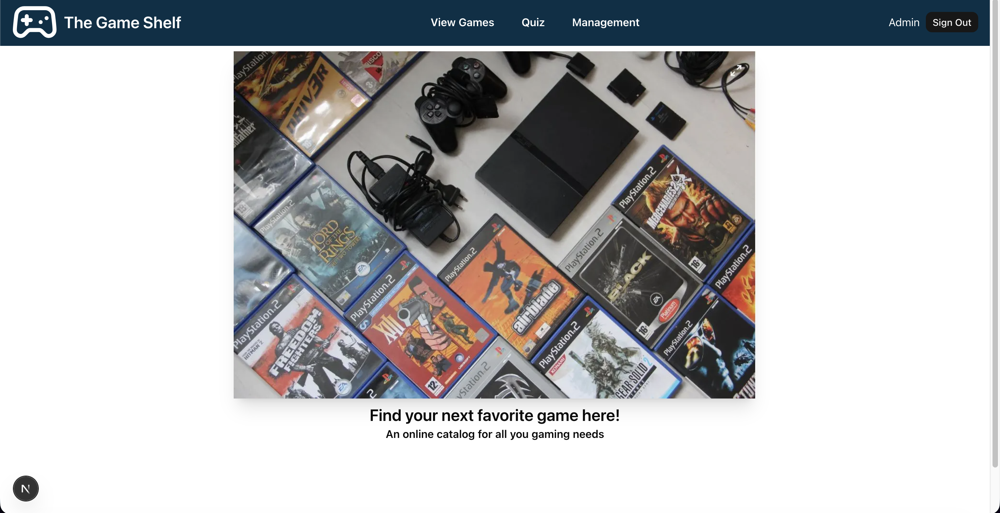
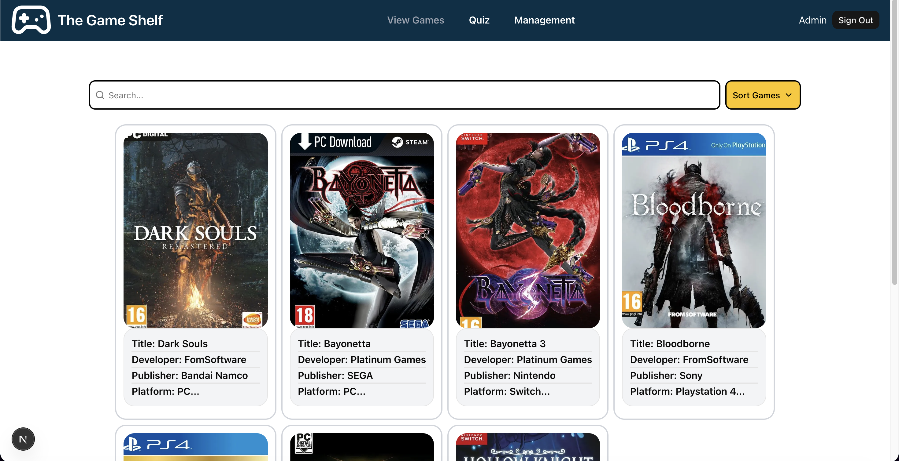
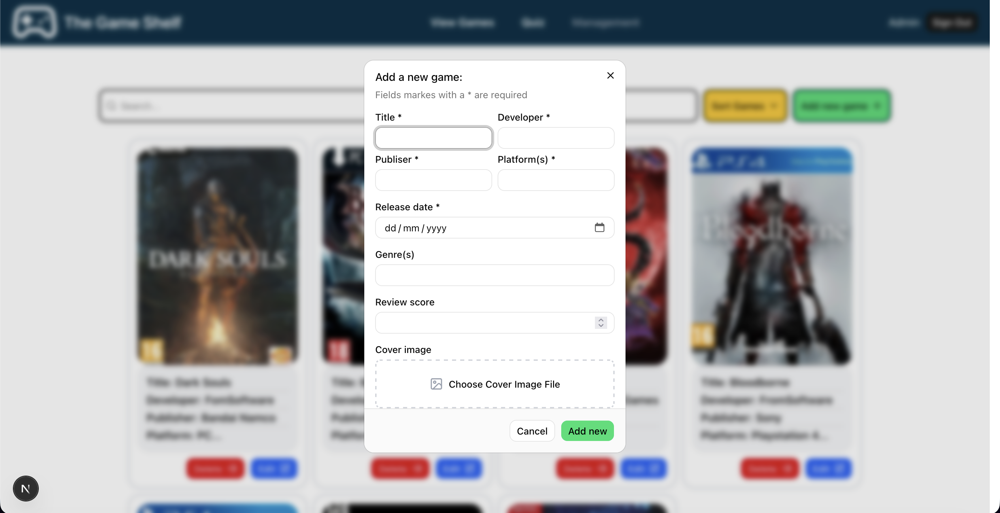

# Game Shelf

<p align="center">
  
  
  
</p>

Game Shelf is a full-stack game discovery and catalog management application. It gives players a focused way to browse, search, and sort a growing collection of games, while providing authenticated administrators with tools to maintain the catalog.

> A before-and-after evolution of [The Game Shelf](https://github.com/N7Vulgaris/TheGameShelf), rebuilt with a modern Next.js stack.

## Highlights

- Built a responsive catalog experience with search, filtering, and sorting across multiple game attributes.
- Added email/password authentication and protected management workflows with Better Auth.
- Connected the application to MongoDB with Mongoose and server-side data access.
- Integrated Cloudinary for game cover image uploads and lifecycle management.
- Created a lightweight quiz flow that turns the catalog into an interactive discovery experience.

## Screenshots

<table>
  <tr>
    <td align="center"><strong>Home page</strong><br></td>
    <td align="center"><strong>Game catalog</strong><br></td>
<td align="center"><strong>Management</strong><br></td>
  </tr>
</table>

## Features

- Browse a live game catalog with cover art and game metadata
- Search and filter by title, developer, publisher, genre, and platform
- Sort by newest, oldest, and alphabetical order
- Create an account and sign in with email/password authentication
- Test game knowledge through an interactive quiz
- Add, edit, and delete games from the management panel
- Upload and remove cover images through Cloudinary

## Tech Stack

| Layer          | Tools                                          |
| -------------- | ---------------------------------------------- |
| Front end      | Next.js 16, React 19, TypeScript, Tailwind CSS |
| UI             | shadcn/ui, Base UI, Lucide React               |
| Data           | MongoDB, Mongoose                              |
| Authentication | Better Auth                                    |
| Media          | Cloudinary                                     |

## Getting Started

Game Shelf is a full-stack game discovery and catalog management app built to demonstrate a modern Next.js workflow with authentication, database-backed CRUD, media handling, and an interactive quiz experience.

### Live Demo

Production app: https://game-shelf-next.vercel.app/

Demo accounts for quick testing:

- Admin account
  - Email: `admin@admin.com`
  - Password: `adminPassword`
- Standard user account
  - Email: `johnny@test.com`
  - Password: `test123456`

### Run Locally

1. Clone the repository and install dependencies:

```bash
git clone https://github.com/your-username/GameShelfNEXT.git
cd game-shelf
npm install
```

2. Start the app:

```bash
npm run dev
```

3. Open the project in your browser:

```text
http://localhost:3000
```

### What You Can Do

- Browse and search a catalog of games with cover art and metadata
- Filter and sort by genre, platform, publisher, and release date
- Sign in with email/password authentication
- Manage catalog content through an admin dashboard
- Upload and remove game cover images via Cloudinary
- Explore the game catalog through a lightweight quiz flow

## Available Routes

| Route         | Purpose                                           |
| ------------- | ------------------------------------------------- |
| `/`           | Landing page                                      |
| `/viewGames`  | Browse, search, filter, and sort games            |
| `/quiz`       | Start the game knowledge quiz                     |
| `/management` | Manage catalog entries with an authorized account |

## Project Structure

```text
game-shelf/
├── app/
│   ├── api/
│   ├── management/
│   ├── quiz/
│   ├── viewGames/
│   └── page.tsx
├── components/
│   ├── dialogs/
│   ├── ui/
│   └── ...
├── lib/
│   ├── auth/
│   ├── models/
│   ├── services/
│   ├── db.ts
│   └── utils.ts
├── public/
├── package.json
├── tsconfig.json
├── next.config.ts
├── eslint.config.mjs
└── README.md
```

## Available Scripts

```bash
npm run dev     # Start the local development server
npm run build   # Create a production build
npm run start   # Run the production build
npm run lint    # Run ESLint checks
```

## Roadmap

- Add dedicated game detail pages
- Let users save games to a favorites list
- Move catalog search and sorting state into URL search parameters
- Continue improving mobile responsiveness and visual polish
- Let admins add / manage questions in the quiz
